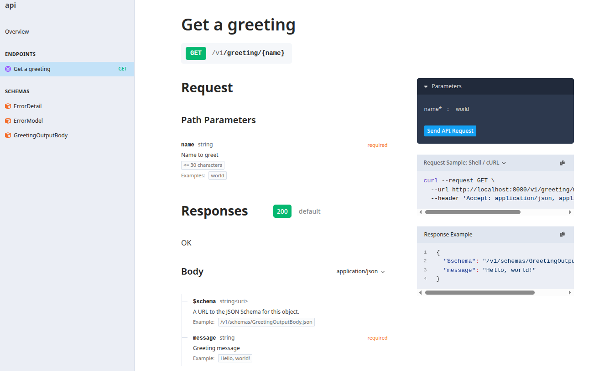

# Golang api boilerplate

## presentation

This is a Huma X Chi golang boilerplate api, ready for containerized environment.

using:

- [Huma api](https://github.com/danielgtaylor/huma): OpenApi schema, input/output validation
- [Chi](https://github.com/go-chi/chi) lightweight router
- [sqlc](https://github.com/sqlc-dev/sqlc) for db interactions
- [zerolog](https://github.com/rs/zerolog) logger
- [migrate](https://github.com/golang-migrate/migrate) for db migrations
- postgresSQL

## preview



## start

```bash
make compose
```

Then visit [localhost:8080/v1/docs](http://localhost:8080/v1/docs)

PGweb UI at [localhost:8081](http://localhost:8081)
